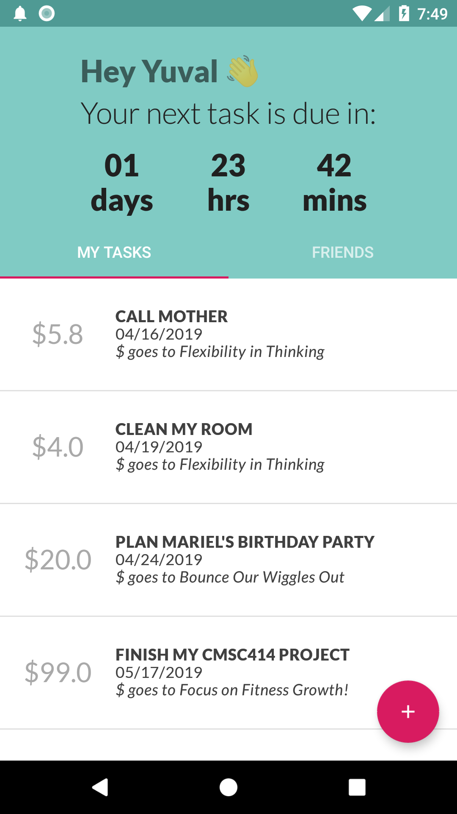
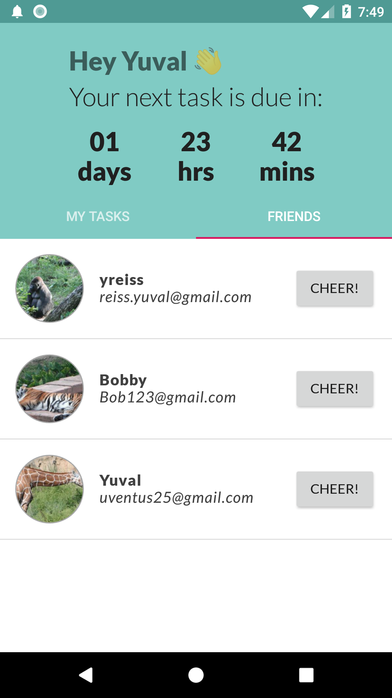
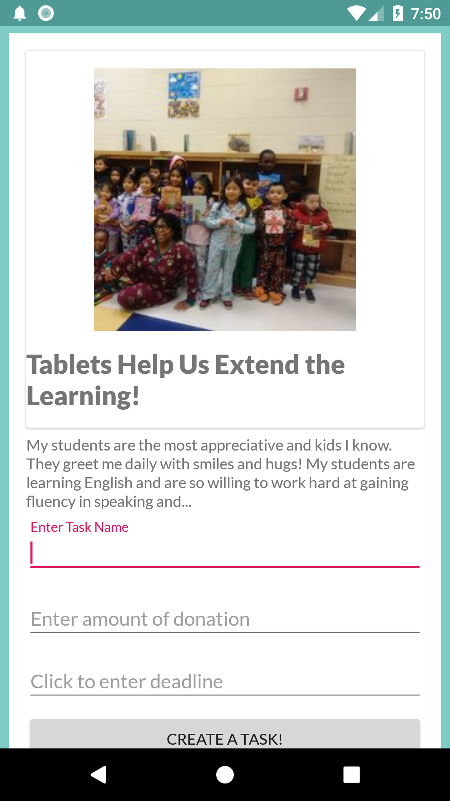

# DoDally

Use your procrastination to empower the American elementary education system!

DoDally allows users to create tasks to be completed, but for each task users can browse through a list of classroom proposals written and posted by teachers seeking extra funding for improvements that would benefit the students. The data is provided by the Donors Choose API. After users select a cause they are prompted to name the task, selects an amount of money, and a deadline for when the task is to be completed. If the task does not get completed by that time, the amount of money specified by the user when creating the task gets donated to that classroom. Users are also able to cheer each other on to complete goals, creating a productive community.

  

